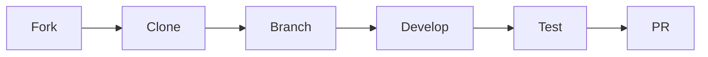

```markdown
# Quiz Game Application

### Live Demo
[Play the Quiz](https://your-deployment-link.com) • [GitHub Repository](https://github.com/1244Matt1244/quiz_game)


## Table of Contents
1. [Features](#features)
2. [Technologies](#technologies)
3. [Installation](#installation)
4. [Usage](#usage)
5. [Configuration](#configuration)
6. [API Documentation](#api-documentation)
7. [Development](#development)
8. [Testing](#testing)
9. [Deployment](#deployment)
10. [Contributing](#contributing)
11. [License](#license)

## Features 🚀
- **Interactive Quiz Interface**
  - Multiple-choice questions
  - Instant feedback system
  - Progress indicator
- **Game Mechanics**
  - Countdown timer (30 seconds/question)
  - Score multiplier based on quick answers
  - Difficulty progression system
- **Data Management**
  - LocalStorage for high scores
  - Session tracking
  - Score history visualization
- **Accessibility**
  - Keyboard navigation (1-4 number keys)
  - Screen reader support
  - Color contrast modes

## Technologies 💻
**Core Stack**
- HTML5 Semantic Markup
- CSS3 (Flexbox/Grid animations)
- Vanilla JavaScript (ES6+)

**Libraries**
- [localForage](https://localforage.github.io/localForage/) - Improved localStorage
- [Chart.js](https://www.chartjs.org/) - Score visualization
- [Howler.js](https://howlerjs.com/) - Sound effects

**Tooling**
- Webpack 5 (Module bundling)
- Babel (ES6+ transpilation)
- ESLint + Prettier (Code quality)

## Installation ⚙️
```bash
# Clone repository
git clone https://github.com/1244Matt1244/quiz_game.git
cd quiz_game

# Install dependencies
npm install

# Development build
npm run dev

# Production build
npm run build
```

## Usage 🎮
1. **Start Quiz**
   ```javascript
   // Initialize quiz with custom options
   const quiz = new Quiz({
     difficulty: 'medium',
     categories: ['science', 'history']
   });
   ```
2. **Answer Questions**
   - Use mouse click or number keys 1-4
   - Earn bonus points for quick answers

3. **Post-Game Options**
   - Save score with username
   - View detailed statistics
   - Share results on social media

## Configuration ⚙️
Create `.env` file:
```ini
# Game Settings
QUESTION_LIMIT=15
MAX_TIME=30
HIGH_SCORE_LIMIT=10
SOUND_ENABLED=true
```

## API Documentation 📚
```javascript
/**
 * Quiz Class API
 * @class
 * @param {Object} options - Configuration options
 */
class Quiz {
  constructor(options) {
    // Initialization logic
  }
  
  // Public methods
  startGame() {}
  endGame() {}
  getStatistics() {}
}
```

## Development 🛠️
**Project Structure**
```
/src
  /assets       # Images/Fonts
  /css          # Stylus/SASS
  /js
    /core       # Game logic
    /ui         # Components
    /data       # Question handling
  index.html
```

**Common Commands**
```bash
# Run development server
npm start

# Lint code
npm run lint

# Build production version
npm run build
```

## Testing 🧪
```bash
# Run test suite
npm test

# Test Coverage Report
npm run coverage
```

**Testing Strategy**
- Unit Tests (Jest)
- Integration Tests (Cypress)
- Performance Audits (Lighthouse)

## Deployment 🚀
**Static Hosting Options**
1. GitHub Pages
   ```bash
   npm run deploy
   ```
2. Netlify
3. Vercel

**CI/CD Pipeline**
```yaml
# .github/workflows/deploy.yml
name: Deploy
on: [push]
jobs:
  build-deploy:
    runs-on: ubuntu-latest
    steps:
    - uses: actions/checkout@v2
    - run: npm install && npm run build
    - uses: peaceiris/actions-gh-pages@v3
      with:
        github_token: ${{ secrets.GITHUB_TOKEN }}
        publish_dir: ./dist
```

## Contributing 🤝
1. Fork the repository
2. Create feature branch
3. Submit Pull Request

**Development Flow**


## License 📄
This project is licensed under the MIT License - see the [LICENSE.md](LICENSE.md) file for details.

---

**Maintainers**  
[@1244Matt1244](https://github.com/1244Matt1244)  
**Support**  
[Open an Issue](https://github.com/1244Matt1244/quiz_game/issues)  
**Roadmap**  
[View Project Board](https://github.com/users/1244Matt1244/projects/1)
```
